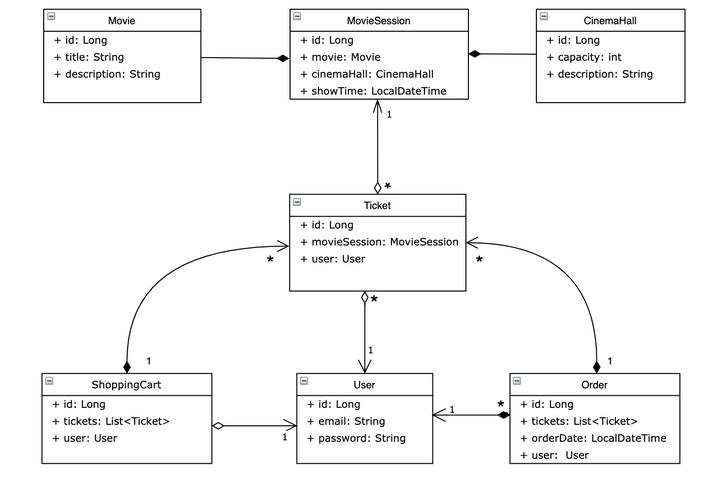

## 🎥 About Cinema project
In this project I want to show my skills in Java, Hibernate, Spring core, Spring Web and Spring
Security.

This project maintains authentication, creation user, movie, movie session and simulates common ticket-purchase apps.
Completed structure of project is described below



- Configure role access to specific resources for `ADMIN` and for `USER` looks like
```
POST: /register - all
GET: /cinema-halls - user/admin
POST: /cinema-halls - admin
GET: /movies - user/admin
POST: /movies - admin
GET: /movie-sessions/available - user/admin
POST: /movie-sessions - admin
PUT: /movie-sessions/{id} - admin
DELETE: /movie-sessions/{id} - admin
GET: /users/by-email - admin
PUT: /shopping-carts/movie-sessions - user
GET: /shopping-carts/by-user - user
GET: /orders - user
POST: /orders/complete - user
``` 
~~~
*Firstly, in this application already exist
two users
  Username "admin@i.ua" Password "12345" with role ADMIN
  Username "user@i.ua" Password "1234" with role USER
  Yoy can register new users using Post method to url /register with body like
  {
    "email": "UserName@gmail.com",
    "password": "1234",
    "repeatPassword": "1234"
  }

  You also can receive user create Get method to url /users/by-email?email=vlad@gmail.com
  You should have role ADMIN
~~~
~~~
* You can add new Movie using Post method to url /movies with body like
  {
  "title": "Name of Movie",
  "description": "About this movie"
  }
  You should have role ADMIN 

  You also can receive all movies create Get method to url /movies
  You should have role ADMIN or USER
~~~
~~~
* You can add new CinemaHall using Post method to url /cinema-halls with body like
  {
  "capacity": 100,
  "description": "About this Hall"
  }
  You should have role ADMIN

  You also can receive all cinema halls create Get method to url /cinema-halls
  You should have role ADMIN or USER
~~~
~~~
* You can add new Movie Session using Post method to url /movie-sessions with body like
  {
  "movieId": 1,
  "cinemaHallId": 1,
  "showTime": "20.06.2022 17:00"
  }
  You should have role ADMIN

  You also can update Movie Session create Put method to url /movie-sessions/{id} with body like
  {
  "movieId": 2,
  "cinemaHallId": 1,
  "showTime": "20.06.2022 20:00"
  }
  You should have role ADMIN

  You also can delete Movie Session create Delete method to url /movie-sessions/{id}
  You should have role ADMIN

  You also can receive all available Movie Session. Create Get method to url 
  /movie-sessions/available?movieId=1&date=20.06.2022
  You should have role ADMIN or USER
~~~
~~~
* You can add new Movie Sessions (Ticket) to your Shopping-Cart.Create Put method to url
  /shopping-carts/movie-sessions?movieSessionId=1
  You should have role USER

  You also can receive information from your Shopping Cart. Create Get method to url
  /shopping-carts/by-user
  You should have role USER
~~~
~~~
* You can complete your Order create Post method to url /orders/complete
  You should have role USER

  You also can receive information about your Orders. Create Get method to url /orders
  You should have role USER 
~~~

## 🛠️ Technologies which I used
Project is created with:
```
* Java 11
* MySQL
* Maven
* Hibernate
* Spring (Core, Web, Security)
* Tomcat 9.0.50 (to run app locally)
```

## 🌐 Setup
You should install MySQL or another DB

Fork this project and clone it.

Now there is dependency "MySQL DB" in `pom.xml`.
~~~
<dependency>
    <groupId>mysql</groupId>
    <artifactId>mysql-connector-java</artifactId>
    <version>8.0.22</version>
</dependency>
~~~
If you have another DB, you should change this dependency to better fit your DB.

Also, in the file `src/main/resources/db.properties` you should fill correct values in these fields
~~~
    db.driver = "DRIVER_NAME";
    db.url = "URL";
    db.user = "USER";
    db.password = "PASSWORD";
~~~
